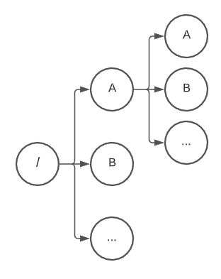

# Definitions

$\mathtt P$ -- Path
>A path is description of a particular file or directory on a particular location on a computer.  Phaths consist of the following relevant properties that contribute to it's identity.
+ Status : The path's Status
  + $\mathtt L$ -- Legal 
    > The path is a legal path and can be resolved on the $\mathbb [∞]$.
  + $\mathtt I$ -- Illegal 
    > The path is illegal and can not be resolved on the $\mathbb [∞]$. 
+ Anchor : The path's Anchor
  + $\mathtt A$ -- Absolute
    > An absolute path: An absolute path will resolve to the exact same location on the $\mathtt [∞]$ regardless of starting location.
  + $\mathtt R$ -- Relative 
    > A relative path: A relative path will resolve to the exact same location on the $\mathtt [∞]$, if and only if ( $\mathbb \leftrightarrow$ ) it is resolved from the same starting location.  Otherwise, it will resolve to a differnt location on the $\mathtt [∞]$.
+ Qaulification: Indicates whether or not a path resolves to the same volume or machine.
  + Fully Qualified ($\mathtt Q$): Indicates that a path is fully qualified to a specific volume.  A path is fully qualifed to a volume if it can not be moved from that volume.
  + Not Qualified ($\mathtt N$): Indicates that the path is not fully qualified and the volume or machine is subject to the currently location when the path is resolved.

  >Posix: Paths are only fully qualified if they are absolutly anchored ($\mathtt A$) so both root and remote paths are Fully Qualifed.  Posix paths are considered to have only one (root) volume for a server under which all paths are contained.
    > Examples: `/dir/file` and `//server/dir/file`

  >Windows: Paths may be fully qualified while not being absolutly anchored ($\mathtt A$).  This is because windows supports the concept of volume relative path which has a relative anchor but is fully qualifed to a specific volume. 
    > Examples: `C:dir\file` and `C:\dir\file` and `\\server\dir\file` **NOTE In the folowing example `C:dir\file` is both Fully Qualified ($\mathtt Q$) and relative ($\mathtt R$)**

+ Segments {$\mathtt S$} : The set of segments for a path.
    > **NOTE: Not all segments are germane to the identity of the path, and thus not all are part of the path's identity.  Only Germane segments constitute a component of a path's identity**

+ Germane Segements {$\mathtt G$} : The set of segments that are germane to the identity of a path.  The germane segments of a path are an inclusive subset of the path's segments
$$
{\mathtt G} \subseteq \mathtt S
$$   

$\mathbb [∞]$ -- Infinity Volume
>A hypothetical drive volume that represents the entire set of all posible resolvable legal paths (or $\mathbb L$)

>

> Under every segment in the tree is the set of all posible Legal Segments $\mathbb S_L$ which each in turn contain the set of all posible Legal Segements $\mathbb S_L$

$\mathtt S$ -- Segment
>A path is a composition of segements composing branch points on a tree that is the volume of a file system.  In this document Infinity Volume $\mathbb [∞]$ is used to represent such a volume. **NOTE: While a volume is actually A [DAG](https://en.wikipedia.org/wiki/Directed_acyclic_graph) and not a [TREE]((https://en.wikipedia.org/wiki/Tree_(data_structure))) in that one point on the volume may have multiple parents via reparse points, that does not affect the semantics of path processing and will not be explored here.**
Segments consist of a type and identity (name) and can be combined according to rules set forth by the operating system.  The following describes the types of segments availalbe. 
+   Root Segment or Volume Rooted segment ($\mathcal R$): This represents a given volume on a operating system.
    > Posix: There is only one Volume Rooted Segment on a posix system which is always **(`/`)**.

    > Windows: Windows supports multiple volume roots depending on the structure of the system.  This are denoted by the identifier (drive leter) in the segment.

    >Examples: `C:\`, `D:\`, `X:\` (note further, the trailing backslash character '`\`' can be omited if there are no further segments so: `C:\` = `C:`, however `C:\dir` $\neq$ `C:dir`)

+   Remote or External Segment ($\mathcal X$): This represents an external volume on a seperate (remote) server (or on the same server if the server specified is the same system)
    >Examples: [**`//server/dir/file`**] or [**`//localhost/dir/file`**]

+   Self Segment ($\mathcal S$): The self segment is a self reference to the current segment.  It is only a relevent segment if it is the only segment.  It may generall be simplified (removed).
    >Examples: [**`.`**], [ **`/.`** $\rightarrow$ **`/`** ]

+   Parent Segment ($\mathcal P$): A reference to the segment preceeding the current segment.  It can generally be simplified unless it would alther the absolute ($\mathtt A$) or relative ($\mathtt R$) anchor of the path or if it would alther the Fully Qualified ($\mathtt Q$) status of the path.

+   Null Segment ($\mathcal N$): The null segment is never a relevant segment.  It strictly exists as a result of imperfections resulting from parsing appraches.  It can in every case be removed or safely substituted with a "Self Segment".
    >Examples: [ **`0x00`** ]

+   Empty Segment ($\mathcal E$): The empty segment is never a relevant segment and can always be safely simplified.

+   Generic Segment ($\mathcal G$): Represents a segment in the middle of a path that is not one of the other segment types.

>WINDOWS ONLY: The following segment types only exist on Windows Operating Systems and are not valid in Posix Paths

+   Device Segment ($\mathcal D$): Represents a device.  Device segments are both absolute ($\mathtt A$) and fully qualified ($\mathtt Q$).  A device segment at any point in a path resolves to the same device so the following cases are all equivilent:
    >Examples: **`C:\COM`** $\mathtt \equiv$ **`COM`** $\mathtt \equiv$ **`C:\dir\COM`**

+   Volumeless Root Segment ($\mathcal /$): Represents a root segment with out specifying the volume it is rooted too.  This makes this segment both absolute ($\mathtt A$) but not fully qualified ($\ne$ $\mathtt Q$).
    >NOTE: It is important not to confuse this with the root ($\mathcal R$) segment on a Posix system as the two share the same path notation **'`/`'**.  Because: **`/`** on a Windows system means the root of the current volume (which may change) where **`/`** means the root of all volumes.

+   Volume Relative Segment ($\mathcal V$): Represents a relative segment on the current volume.  This makes this segment both relative ($\mathtt R$) and fully qualified ($\mathtt Q$).  
    >NOTE: It is important not to confuse this with the root ($\mathtt R$) segment because they share a similar notation.  However: **`C:dir`** $\ne$ **`C:\dir`**
    